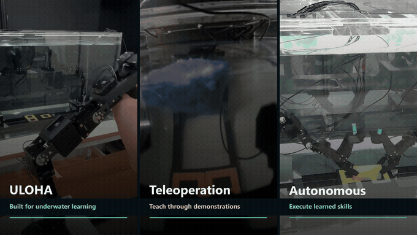
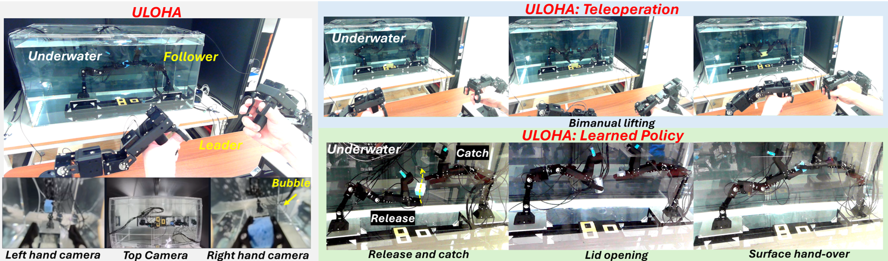
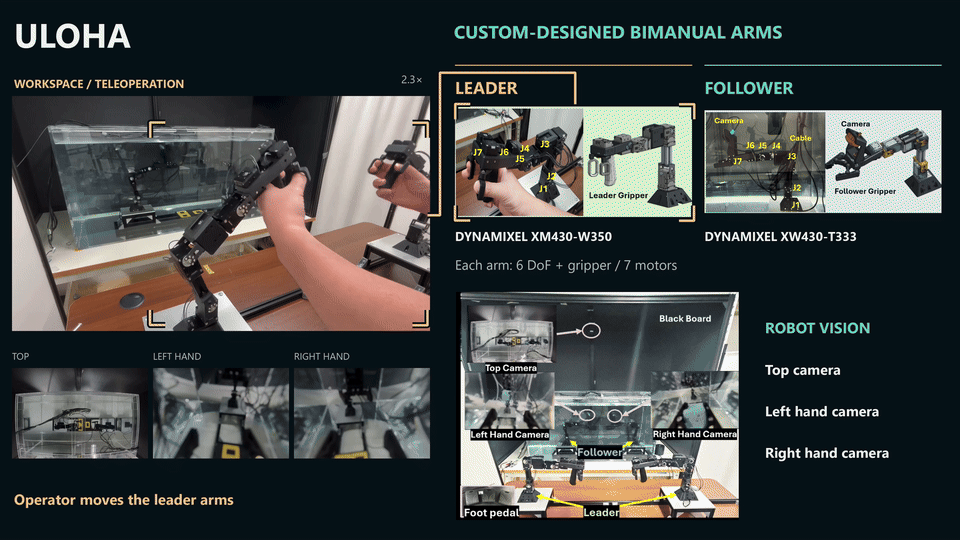
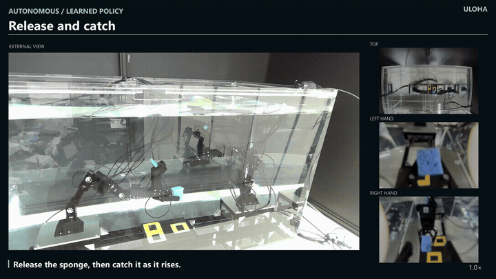
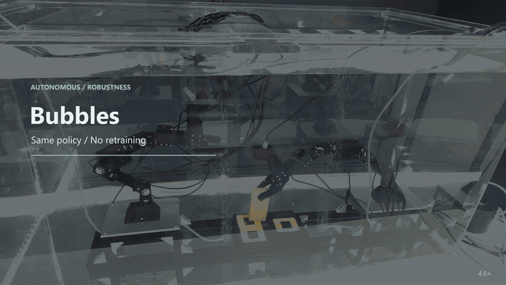

# ULOHA

### An Underwater Bimanual Robot System for Robot Learning

[Project Website](https://mertcookimg.github.io/uloha/) · [Paper (arXiv)](https://arxiv.org/abs/2609.19200) · [Video](https://youtu.be/0QUS7BZZKas) · [Release Roadmap](docs/roadmap.md)

**[Masato Kobayashi](https://mertcookimg.github.io/en/)\* and Takeru Tsunoori\***<br>
The University of Osaka / Kobe University, Japan<br>
\* Equal contribution

[](https://youtu.be/0QUS7BZZKas)

*From demonstrations to autonomous underwater skills. Click the preview to watch the project video.*

⭐ If you find ULOHA interesting, please consider giving this repository a star. Your support motivates us to keep developing the project!

> **Release status:** This is the official project hub for ULOHA. Hardware design files and ULOHA software, developed by modifying and extending LeRobot, are being prepared for public release and are **not included in this repository**. Component-specific licenses will be announced before release.

## Overview

ULOHA is an underwater bimanual robot learning platform that connects custom leader–follower hardware with software developed by modifying and extending LeRobot for teleoperation, demonstration collection, policy training, and autonomous execution.

- **Bimanual manipulation underwater:** two dry leader arms control two underwater follower arms, each with six arm joints and an actuated gripper.
- **Demonstrations to policies:** joint states and three camera views support learning coordinated manipulation skills.
- **Nine bimanual tasks:** inter-arm transfers, shared-object manipulation, and buoyancy-driven interception, evaluated with task-specific ACT policies. Diffusion Policy and SmolVLA are also deployed on selected tasks.
- **Underwater evaluation:** experiments examine bubbles, action execution timing, real-time chunking, and transfer between air and water.



## Hardware

[](https://youtu.be/0QUS7BZZKas?t=10)

*Dry leader arms control underwater followers. The hardware overview shows the arm designs, waterproof cable routing, and the top, left hand, and right hand cameras. Click the GIF to watch this section in the project video.*

ULOHA uses custom-designed leader and follower structures with waterproof follower actuators. Design files, a bill of materials, and build instructions are being prepared for release.

### Software

ULOHA software is based on [LeRobot](https://github.com/huggingface/lerobot), which we modified and extended for our underwater robot hardware, teleoperation, demonstration recording, policy training, and deployment. These ULOHA-specific modifications are maintained separately from the upstream LeRobot project. This repository will link to the software release once its scope and distribution are finalized.

## Demonstrations

### Release and catch

[](https://youtu.be/Rt3p8IpZxWo?t=8)

*Autonomous buoyancy-driven manipulation: one arm releases a submerged sponge, and the other catches it as it rises.*

### Bubble disturbances

[](https://youtu.be/4e4Q1ddJgow?t=1)

*Autonomous object transfer under bubbles using the same ACT checkpoint without retraining. This is a selected execution example; the full video also includes a transfer failure and bimanual lifting.*

### All videos

| Video | Duration | What it shows |
| --- | --- | --- |
| [Project overview](https://youtu.be/0QUS7BZZKas) | 2:59 | Platform, demonstrations, learned behaviors, and deployment experiments |
| [ULOHA · Teleoperation · Autonomous](https://youtu.be/FOMAApPg5N4) | 0:03 | Three-panel preview of the platform, demonstrations, and learned skills |
| [Teleoperation](https://youtu.be/XeRrV-E_iO8) | 0:28 | Collecting underwater demonstrations with dry leader arms |
| [Autonomous bimanual manipulation](https://youtu.be/rmsifdwC0xQ) | 0:57 | Lifting, hand-over, placement, stacking, sequential transfer, insertion, and lid opening |
| [Buoyancy-driven manipulation](https://youtu.be/Rt3p8IpZxWo) | 0:15 | Surface hand-over and release and catch |
| [Failure examples](https://youtu.be/Bm3o0PZY7T4) | 0:13 | Unsuccessful stacking, surface hand-over, and release-and-catch examples |
| [Bubble disturbances](https://youtu.be/4e4Q1ddJgow) | 0:18 | Transfer and bimanual lifting under bubbles, using policies without retraining |
| [SmolVLA: synchronous execution and RTC](https://youtu.be/dJk7G6m8Klk) | 0:08 | Side-by-side examples of synchronous execution and real-time chunking |
| [Air–water transfer](https://youtu.be/OT_zKzpYjnc) | 0:15 | Single-medium and mixed-medium training, including evaluation with an unseen object |


See the [paper](https://arxiv.org/abs/2609.19200) and [project website](https://mertcookimg.github.io/uloha/) for experimental conditions, results, and limitations.

## Release Status

| Component | Status |
| --- | --- |
| Paper | [Available on arXiv](https://arxiv.org/abs/2609.19200) |
| Project website | [Available](https://mertcookimg.github.io/uloha/) |
| Demo videos | Linked above |
| Hardware designs, bill of materials, and assembly instructions | Coming soon |
| ULOHA software (based on LeRobot) | Coming soon |

Release scope, locations, and component-specific licenses will be announced here. No release dates have been set. See the [roadmap](docs/roadmap.md).


## Citation

If you use this work in your research, please cite the paper:

```bibtex
@misc{kobayashi2026uloha,
  title={ULOHA: An Underwater Bimanual Robot System for Robot Learning},
  author={Masato Kobayashi and Takeru Tsunoori},
  year={2026},
  eprint={2609.19200},
  archivePrefix={arXiv},
  primaryClass={cs.RO},
  url={https://arxiv.org/abs/2609.19200}
}
```

Machine-readable citation metadata is provided in [CITATION.cff](CITATION.cff).

## Licensing

Licensing for ULOHA hardware, software, and repository documentation is being determined. No repository-wide license is assigned at this stage. Component-specific licenses will be specified before the corresponding materials are released. External projects and linked resources retain their own licensing terms.

## Team

*Roles as of September 16, 2026. Both authors contributed equally to this work.*

- **Masato Kobayashi** — Assistant Professor; project technical lead.
  Software and hardware development, experiments, manuscript preparation, video production, and website development.
- **Takeru Tsunoori** — Second-year master’s student.
  Hardware development, experiments, and manuscript preparation.

## Acknowledgements

We sincerely thank the developers, maintainers, and contributors of [LeRobot](https://github.com/huggingface/lerobot). Their work on accessible robot learning tools provided the software foundation that we modified and extended for ULOHA.

We also gratefully acknowledge the researchers behind ALOHA, ALOHA 2, ACT, Diffusion Policy, and SmolVLA. Their contributions to bimanual manipulation and robot learning helped shape this work and the methods evaluated on our platform. Please see our [paper](https://arxiv.org/abs/2609.19200) for the corresponding references and further work that informed ULOHA.

We are grateful to the broader robotics and open-source communities for sharing their research, tools, and knowledge, and to everyone who takes an interest in ULOHA. Your feedback and encouragement are deeply appreciated.

## Contact

For research inquiries, contact [Masato Kobayashi](https://mertcookimg.github.io/en/). Project questions and release requests can be raised in [GitHub Issues](https://github.com/mertcookimg/ULOHA/issues).

⭐ If you find ULOHA interesting, please consider giving this repository a star. Your support motivates us to keep developing the project!
